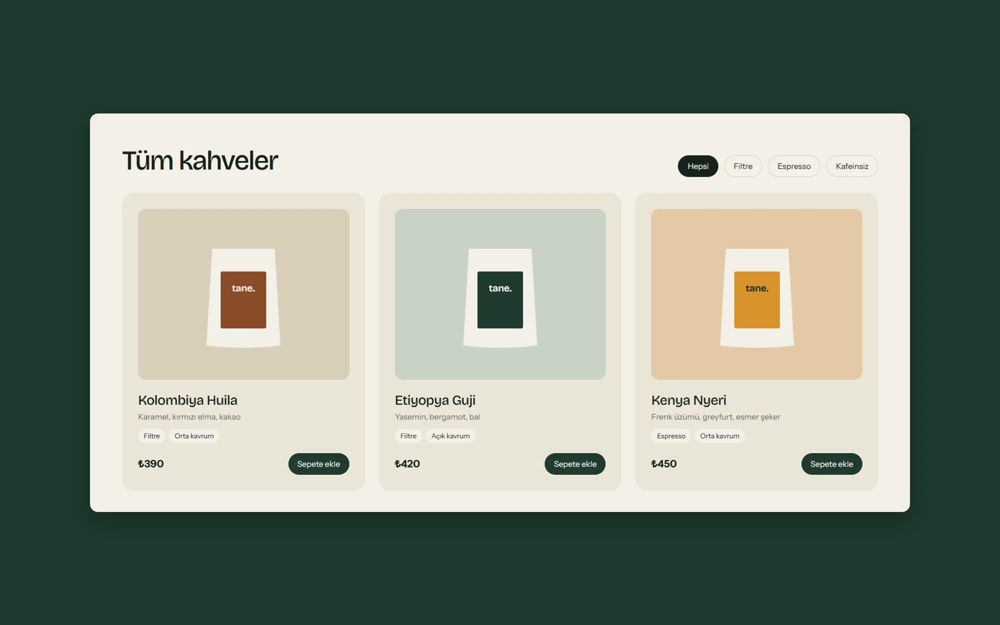
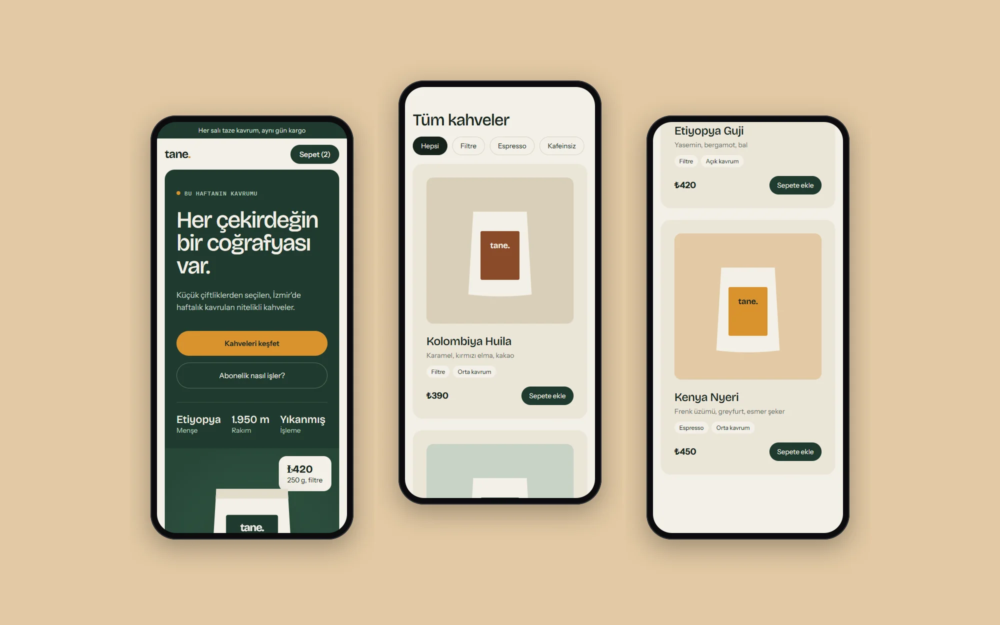

> This is concept work. The brand, the content and the people shown in the interface are fictional. It was not made for a real client.

## Problem

Small roasters usually launch with off-the-shelf themes that reduce every coffee to the same product card. Yet what convinces a specialty coffee buyer is origin, altitude and tasting notes. The store needed to bring that information forward without making purchase any harder.

## Approach

We put the roast of the week at the center of the home page. Origin, altitude and process read at the same glance as the price. Product cards show tasting notes and roast level as small tags, and filters stay on a single line.

The forest green and amber palette speaks about where the coffee comes from rather than the coffee itself. The bag drawings keep the store consistent until real product photography is ready.

## Outcome

On mobile, the announcement bar, cart and main action stay on the first screen. The product list runs in a single column at a comfortable tap size. The concept provides a component set that can extend to product pages and a subscription flow.

