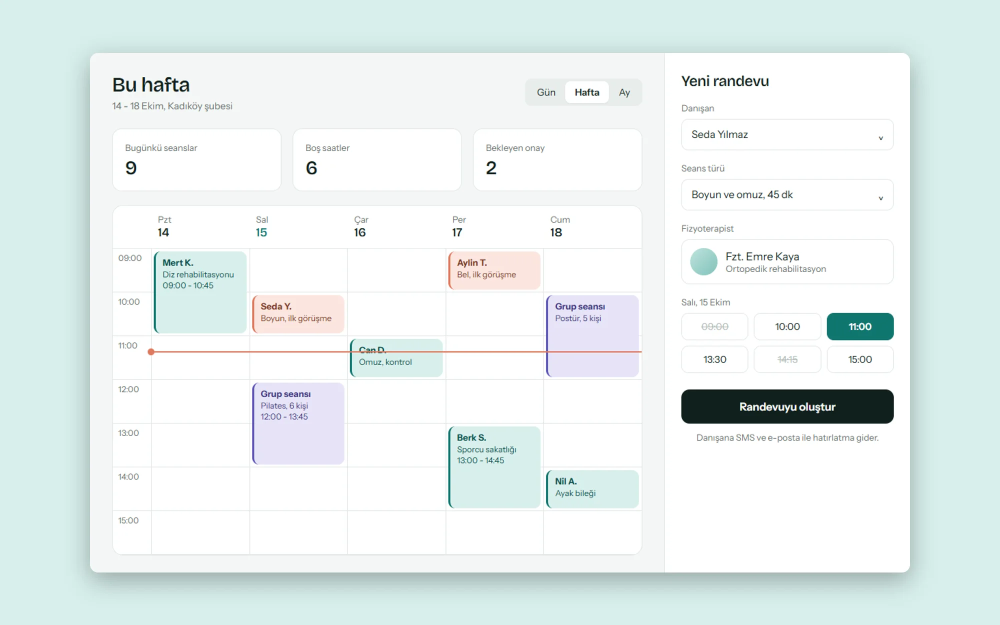
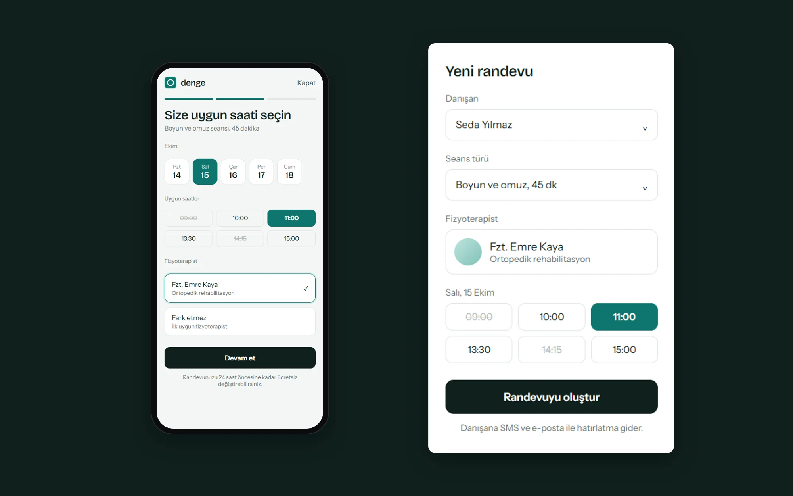

> Este es un trabajo conceptual. La marca, los contenidos y las personas de la interfaz son ficticios. No se hizo para un cliente real.

## Problema

Las clínicas suelen gestionar las citas entre llamadas, mensajes y una agenda en papel. Eso provoca sesiones solapadas, huecos vacíos y recordatorios tardíos. El equipo necesitaba ver la semana de un vistazo y los pacientes debían poder reservar con pocos toques.

## Enfoque

En la parte de la clínica, el calendario semanal pasó a ser la pantalla principal. Los tipos de sesión se distinguen por color y por una etiqueta escrita a la vez, no solo por color, para que también los vean quienes tienen dificultad para distinguir colores.

El panel de nueva cita permanece abierto junto al calendario. Las horas ocupadas aparecen tachadas y no se pueden elegir, lo que evita las citas dobles antes de que ocurran.

## Resultado

La parte del paciente es un flujo móvil de tres pasos: servicio, fecha y hora, y confirmación. Cada paso pide una sola decisión y la política de cambios se indica con claridad antes de confirmar. El concepto une la gestión de la clínica y la experiencia del paciente en un mismo sistema de diseño.

