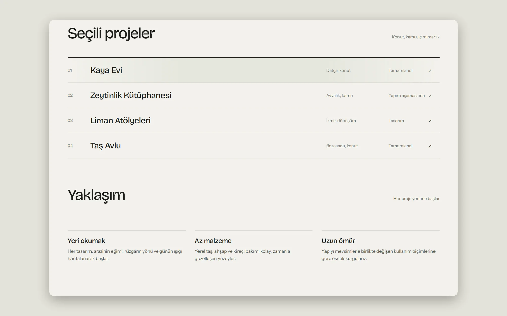
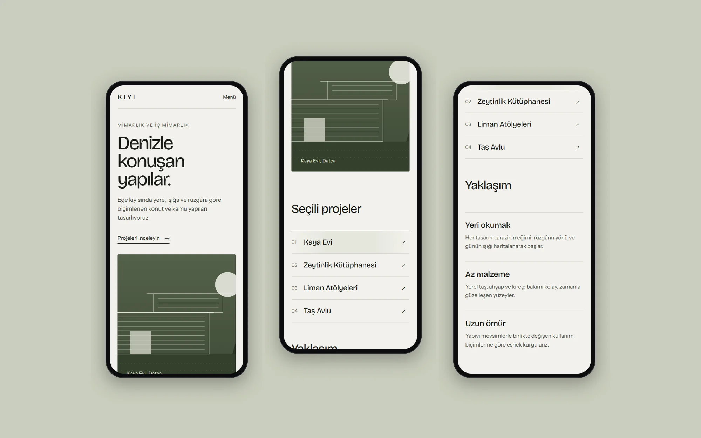

> Bu bir konsept çalışmadır. Marka, içerikler ve arayüzdeki kişiler kurgusaldır. Gerçek bir müşteri için hazırlanmamıştır.

## Problem

Mimarlık ofislerinin siteleri çoğu zaman ya ağır görsellerle yavaşlar ya da her projeyi aynı ızgaraya sıkıştırır. Yere özgü tasarlayan bir ofis için sitenin projeleri bir katalog gibi değil, her birinin hikâyesiyle anlatması gerekiyordu. Ziyaretçi, ofisin yaklaşımını ilk ekranda anlayabilmeliydi.

## Yaklaşım

Sayfanın dilini ofisin malzeme anlayışından türettik: kireç rengi bir zemin, zeytin yeşili tek bir vurgu ve büyük, sıkı aralıklı başlıklar. Proje listesi, görsellerle dolu bir ızgara yerine konum, tür ve durum bilgisini aynı satırda gösteren sade bir dizin olarak kurgulandı. Böylece sayfa hızlı açılıyor ve her proje kendi sayfasında büyük görsellerle anlatılabiliyor.

Ana görselde fotoğraf yerine yapının cephesini çizgi diliyle anlatan bir illüstrasyon kullanıldı. Bu seçim, gerçek proje fotoğrafları eklenene kadar sitenin eksik görünmesini de engelliyor.

## Sonuç

Konsept; ana sayfa, proje dizini ve yaklaşım bölümünden oluşan, masaüstünde ve mobilde aynı sakinliği koruyan bir tasarım dili ortaya koyuyor. Mobilde proje dizini tek sütuna iner, başlık ve görsel sırası korunur.

